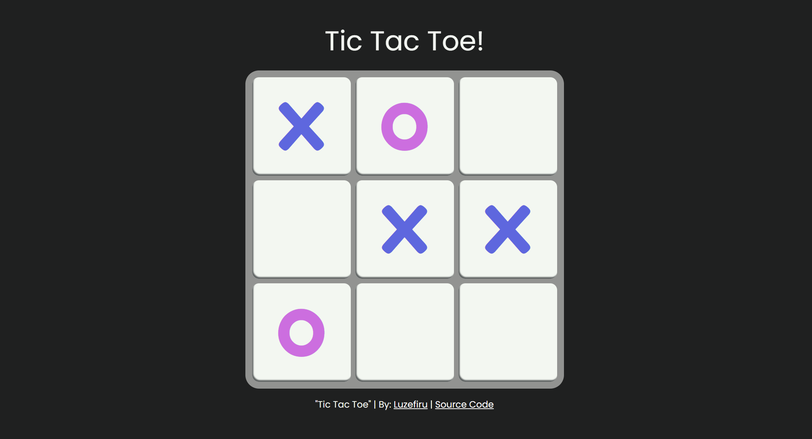

# odin-tic-tac-toe
An interactive Tic Tac Toe browser game to practice the JavaScript Module Pattern and Factory Function Closure.

This project served as my gateway towards using the Module Design Pattern with Factory Functions, taking advantage of Function Closure whenever possible to reduce name pollution in the global scope. JavaScript has a very interesting mechanic of allowing inner functions access outer function data (variables, methods, etc.) inside their own local scope. This behavior is made more unique when those inner functions retain the values even when the outer function finishes invoking. In a way, it's similar to the `static` modifier in the C Programming Langauge because even if the outer function returned, the data inside it is retained inside the heap, so that its inner functions can still access references to them.

In order to do this, we have to return an object containing the methods & variables you want to share (Public Data), while the others can be Privatized as Private Data (also sometimes called Privileged).

```JavaScript
const calculator = (() => {
  const add = (a, b) => a + b;
  const sub = (a, b) => a - b;
  const mul = (a, b) => a * b;
  const div = (a, b) => a / b;
  return {
    add,
    sub,
    mul,
    div,
  };
})(); // IIFE - Immediately Invoked Function Expression
      // creates a calculator object that has methods to do arithmetic
      
calculator.add(3,5);
calculator.sub(6,2);
calculator.mul(14,5534);
```

I need to improve on:
- Object Oriented programming concepts
- lessening the coupling between modules
- thinking in modular code design to separate the DOM rendering, Program Logic, and User Interaction functionalities

# Output
### [Visit the Website Here](https://luzefiru.github.io/odin-tic-tac-toe/)


# Requirements
These were the requirements in The Odin Project's [Project: Tic Tac Toe](https://www.theodinproject.com/lessons/node-path-javascript-tic-tac-toe) course to serve as project specifications. Website aesthetic choices and implementation solely depended on me, the programmer.
